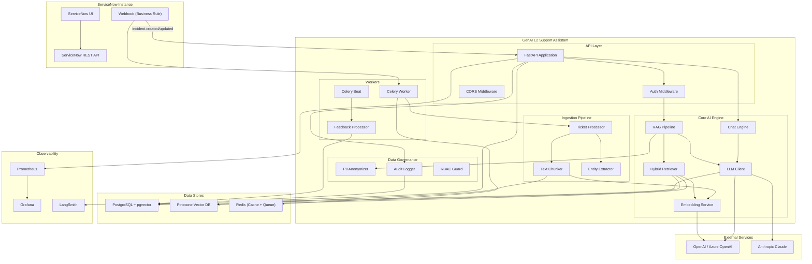
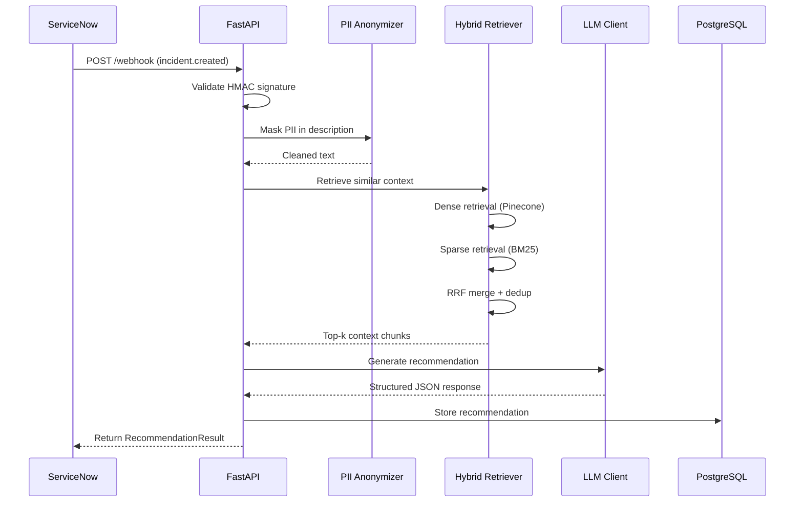
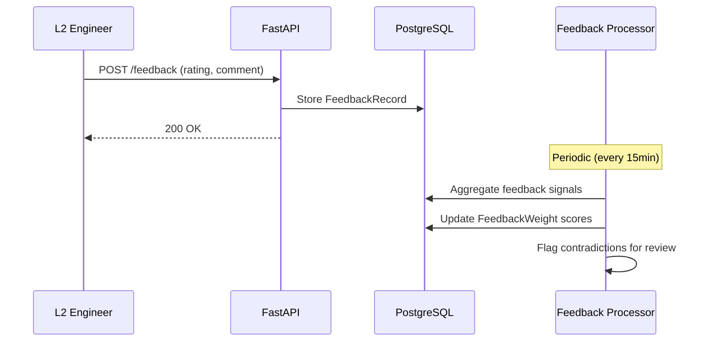

# Architecture Overview

## System Diagram

## Component Descriptions

### API Layer

| Component | Description |
|-----------|-------------|
| **FastAPI Application** | Main HTTP server exposing REST endpoints for incident analysis, chat, feedback, and health checks. Runs on uvicorn with async support. |
| **Auth Middleware** | Validates ServiceNow webhook HMAC signatures and API key authentication for direct API access. |
| **CORS Middleware** | Restricts cross-origin requests to the configured ServiceNow instance domain. |

### Core AI Engine

| Component | Description |
|-----------|-------------|
| **RAG Pipeline** | Orchestrates the full Retrieval-Augmented Generation flow: receive incident → retrieve context → build prompt → generate recommendation → structure output. |
| **Hybrid Retriever** | Combines dense (vector) retrieval from Pinecone/pgvector with sparse (BM25) keyword retrieval, merging results via Reciprocal Rank Fusion (RRF). |
| **Embedding Service** | Generates text embeddings using OpenAI's `text-embedding-3-large` (3072 dimensions). Batches requests for efficiency. |
| **LLM Client** | Abstraction over OpenAI (GPT-4o) and Anthropic (Claude 3.5 Sonnet) with automatic retries, rate limiting, and structured JSON output parsing. |
| **Chat Engine** | Manages multi-turn conversational follow-ups on incidents, maintaining session history and injecting relevant context. |

### Ingestion Pipeline

| Component | Description |
|-----------|-------------|
| **Ticket Processor** | NLP preprocessing pipeline: text cleaning, entity extraction (error codes, services, versions), incident type classification, and keyword extraction. |
| **Text Chunker** | Sentence-boundary-aware text splitting with configurable chunk size and overlap. Preserves KB article section titles. |
| **Entity Extractor** | Extracts structured entities (SERVICE, ERROR_CODE, HOSTNAME, VERSION) using regex patterns and optional spaCy NER. |

### Data Governance

| Component | Description |
|-----------|-------------|
| **PII Anonymizer** | Masks emails, phone numbers, IP addresses, hostnames, person names (in context), and cloud API keys before sending text to the LLM. Preserves UUIDs and technical identifiers. |
| **Audit Logger** | Records all significant events (ticket_analyzed, recommendation_served, feedback_submitted) to the audit_events table for compliance. |
| **RBAC Guard** | Role-based access control restricting operations by engineer role (L2, L3, admin). |

### Workers

| Component | Description |
|-----------|-------------|
| **Celery Worker** | Async task execution for incident ingestion, embedding generation, and batch processing. |
| **Celery Beat** | Scheduled tasks: periodic ServiceNow sync, feedback aggregation, stale index cleanup. |
| **Feedback Processor** | Aggregates engineer feedback signals to compute source quality scores, boosting or penalizing retrieval results. |

### Data Stores

| Component | Description |
|-----------|-------------|
| **PostgreSQL** | Primary relational store for incidents, recommendations, feedback, audit events, and chat sessions. Uses pgvector extension for optional local vector storage. |
| **Pinecone** | Managed vector database for production-scale similarity search. Stores 3072-dimensional embeddings with metadata filtering. |
| **Redis** | In-memory cache for session data and Celery task broker/result backend. |

## Data Flow

### Incident Analysis Flow

### Feedback Loop

## Key Design Decisions

1. **Hybrid Retrieval**: Dense + sparse retrieval with RRF provides better recall than either method alone, especially for keyword-heavy IT incident text.

2. **PII-First Governance**: PII masking runs before any text reaches the LLM, ensuring personal data never leaves the organization boundary.

3. **Confidence-Based Escalation**: Recommendations with confidence < 0.6 are automatically flagged for L3 escalation to prevent incorrect resolutions.

4. **Feedback-Weighted Retrieval**: Engineer feedback adjusts source quality scores, creating a continuous learning loop without model fine-tuning.

5. **Async-Everything**: All I/O operations use async/await for optimal throughput under concurrent incident load.
