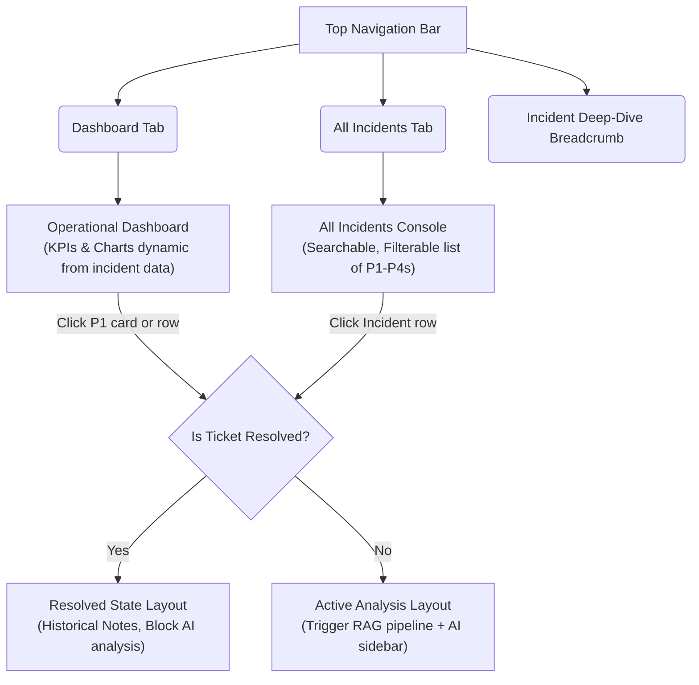

# Walkthrough: Integrated ServiceNow AI Console

We have successfully integrated the operational dashboard and the AI analysis sidebar simulator into a single, unified Single-Page Application (SPA) at [index.html](file:///d:/L2_Assistant/genai-l2-assistant/servicenow/widget/index.html). We also added the dedicated **All Incidents Directory** console page, backed by a new FastAPI `GET` endpoint and dynamic KPI/chart computations.

---

## What Was Accomplished



### 1. Database Seeding & Deterministic Mapping (`seed_test_data.py`)
- Configured **deterministic UUID `sys_id` values** for all seeded incidents using `uuid5(NAMESPACE_DNS, number)`. This ensures alignment between mock mode and live mode.
- Created a mix of **active and resolved tickets**:
  - `INC0050001`, `INC0050003`, `INC0050007`, and `INC0050010` are now active (state `"1"` - New or `"2"` - In Progress). Their resolution details (`resolved_at`, `resolution_notes`, `root_cause`) are set to `None`.
  - The remaining 6 incidents are resolved (state `"6"`), containing their original resolution details.
- Automatically clears database tables on rerun to make the seed script idempotent.

### 2. FastAPI Endpoints & Validation (`app/api/routes/incidents.py`)
- Created `GET /api/v1/incidents` which returns a list of all incidents in the database combined with their latest AI recommendation status (analyzed, low confidence, or not analyzed) and confidence scores via a SQL outer join.
- Updated `POST /api/v1/incidents/analyze` and the fresh analysis routine in `GET /api/v1/incidents/{sys_id}/recommendation` to block analysis on resolved tickets, returning a `400 Bad Request`.

### 3. Integrated SPA Frontend (`servicenow/widget/index.html`)

#### A. Three-Way Navigation & Fluid Switch
- Persistent tabs for **Dashboard** and **All Incidents** in the topbar.
- CSS `@keyframes` slide animations (300ms) for smooth views transitions.
- Breadcrumbs and a back button dynamically track the referrer (either Dashboard or All Incidents console) when deep-diving.

#### B. Dynamic KPIs & Charts
- KPI metrics (Total, Open, Resolved, Average MTTR, SLA Compliance, and AI Approval Rate) are computed in real time from the shared `INCIDENTS` array.
- Dynamic Chart.js renderers update Volume, Application distribution, Priority donut, MTTR trends, and feedback charts immediately whenever the incident list is loaded or updated.

#### C. All Incidents Console View
- A dedicated page containing a full-width console table for all incidents (P1 to P4, resolved and unresolved).
- Real-time text search (number, description, CMDB CI) and filter dropdowns (by Priority, AI Status, and State).
- Status badges: priority pills, state badges, and AI status indicators (`✓ Analyzed [Score%]`, `⚠ Low Confidence`, `● Not Analyzed`).

#### D. Active-Only Analysis Layout
- For **active tickets** (e.g. `INC0050001` or `INC0050007`): Triggers/loads AI analysis.
- For **resolved tickets** (e.g. `INC0050002`): Renders a dedicated historical layout showing "Incident Resolved" with pre-existing resolution notes and root cause, hiding the interactive chat and triage checkboxes.

#### E. Backend Payload Alignment
- Aligned `fetch` payloads with the FastAPI backend schema (`snow_sys_id` and `engineer_id` parameters mapped correctly).

---

## How to Verify Locally

### Step 1: Run Infrastructure & Seed Database
In your PowerShell console, ensure Postgres/Redis docker containers are running, then run the seeding script:
```powershell
# Set Cwd to genai-l2-assistant, then:
d:\L2_Assistant\.venv\Scripts\python.exe -m scripts.seed_test_data
```

### Step 2: Start API Server & Celery Worker
Ensure uvicorn and Celery are running in separate terminals (currently active in the background of this session):
```powershell
# Term 1: FastAPI Dev Server
d:\L2_Assistant\.venv\Scripts\uvicorn app.main:app --reload --host 0.0.0.0 --port 8000

# Term 2: Celery Worker
d:\L2_Assistant\.venv\Scripts\celery -A app.workers.celery_app worker --loglevel=info --pool=solo
```

### Step 3: Open Console in Browser
1. Open [index.html](file:///d:/L2_Assistant/genai-l2-assistant/servicenow/widget/index.html) in your web browser.
2. Verify the **Dashboard** metrics and charts load dynamically.
3. Switch to the **All Incidents** tab to see the directory listing:
   - Try searching e.g., "coredns" or "OOM".
   - Filter priority by "P2".
4. Toggle **Mock Mode OFF** (top right) to connect to your live running FastAPI server:
   - Click "All Incidents" tab to load live database entries.
   - Click a row for an unresolved incident (e.g. `INC0050001` or `INC0050007`) to trigger live RAG analysis.
   - Click a row for a resolved incident (e.g. `INC0050002`) to verify the read-only resolved ticket view.
